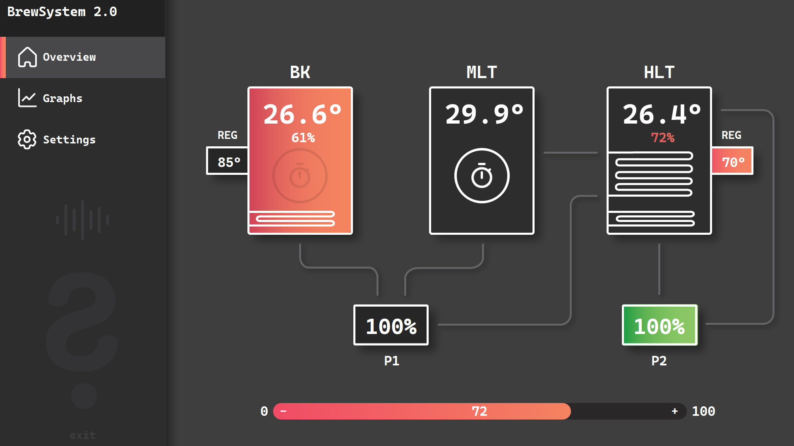
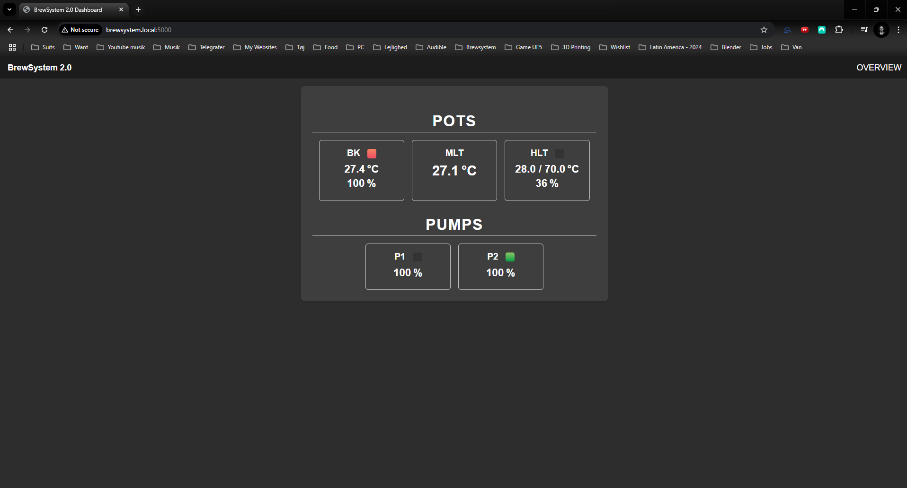
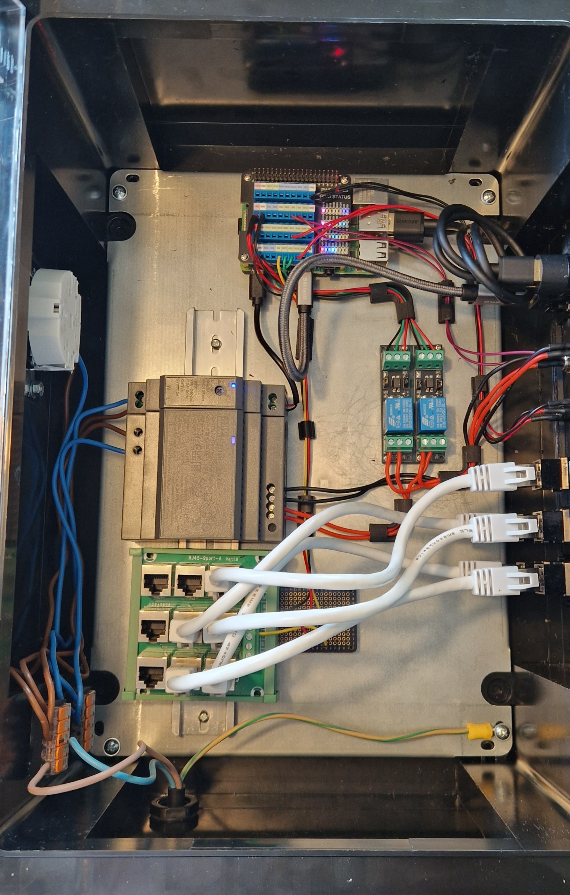

### Main Dashboard

This is the main dashboard of the brewsystem's touchscreen interface. It provides a real-time, interactive overview of the core brewing components in a Heat Exchange Recirculating Mash System (HERMS).

- **Boil Kettle (BK)**  
  - Displays current temperature  
  - Heater efficiency (0–100%)  
  - Regulator target temperature (REG Temp)  
  - REG State: ON/OFF  
  - An **automatic boil timer** starts when the kettle reaches 99 °C  

- **Mash Lauter Tun (MLT)**  
  - Displays current temperature  
  - Manual **mash timer** for tracking mash durations  

- **Hot Liquor Tank (HLT)**  
  - Displays current temperature  
  - Heater efficiency (0–100%)  
  - Regulator target temperature (REG Temp)  
  - REG State: ON/OFF  

- **Pumps (P1 & P2)**  
  - ON/OFF control for each pump  
  - Speed control via efficiency setting (0–100%)  

The interface makes it easy to monitor and control the full brew cycle directly from the touchscreen.

---

### Graph Section

This section visualizes temperature data over time for the different pots. It helps monitor and fine-tune the brewing process with greater precision.

---

### Web Interface

This is the web-based interface of the brewsystem. It provides remote access to live data and control options for monitoring and managing the brew session.

---

### Physical Controller Box

This is the physical control cabinet that houses the electronics responsible for powering and managing the brewsystem. It interfaces with sensors, actuators, and the software running on the Raspberry Pi.

**Main components:**
- Raspberry Pi 4B  
- 92 W | 24 V DC | 3.83 A power supply (for pumps)  
- 15 W | 5 V DC | 3 A power supply (for Raspberry Pi)  
- RJ45 9-port splitter (for DS18B20 temperature sensors)  
- 2 × 3 V relays (to control the pumps)  

